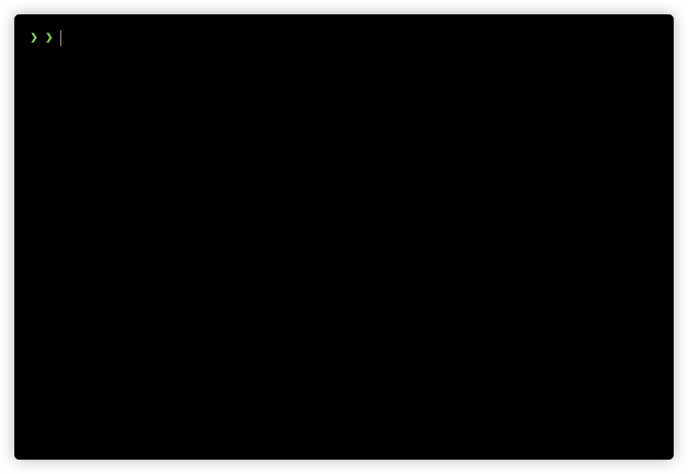

# ballbounce
### Terminal ball bouncing in Rust

I'm learning Rust, this is a small and fun project just to challenge myself.

It works! This is the `v0.4.0`:

It was a long way to get to the above... Here are some pieces of this journey.

This was the first version.

---

Here's how I feel I can challenge myself even more, in order of complexity, followed by my actions when already done:

- ~first version, with fixed integer position and velocity~ 
    - defined project structure, with data, main loop and animation steps;
    - implemented Display for Game.
- ~random initial ball position and velocity~ 
    - include `rand` dependency;
    - this has introduced floating point positions and velocity, enabling much more freedom of movements.
- ~several balls at the same time~ 
    - this tests every cell for any ball in there, but Rust is FAST;
    - caches the ball positions in i32s, with only one allocation, to try to reduce impact of the above;
    - I've included a frame counter, to see if the terminal was actually refreshing (it was hard to find those balls! 😅).
- ~random balls color and representation~ 
    - introduces a cool new color system using a macro;
    - removed the ball positions cache, as I needed the actual balls with their positions;
        - switched for a method that does the cast on demand for each ball for each cell (have I said Rust is FAST?);
    - removed the frame counter;
    - known issue: when more than one ball is at the same cell, only the first found one is drawn.
- ~implement a double buffering system for rendering the screen~ 
    - refactored the whole project to split modules (which introduced nice visibility concerns);
    - implemented an actual game loop;
    - improved the `style!` macro with `format_args!`, enabling to style only parts of a text;
    - merged colors and styles, reducing code duplication;
    - implemented Display for Style, so blocks of text can be styled directly, without unnecessary replicated styles;
    - inverted the control of the drawing system: instead of the board testing for the existence of balls, the balls draw themselves into the board;
    - created a FrameBuffer system, which stores the game data already resolved cited above, and without any allocations;
    - included a small number in the lower right corner to show the frame time in millis;
    - Game has now two frame buffers, and swaps between them when a new frame is ready (before it took between 0 and 10 millis to render one frame, now it is nicely steady at 0, which means sub-millisecond 👏).
- ~make the #1 ball always a red ◉, and remove duplications~ 
    - created a FrameRow abstraction;
    - include `itertools` dependency;
    - improved Display for FrameBuffer and implemented it for FrameRow, optimized with itertools;
    - implemented a build system for Ball, now we can choose some fields, which will not be random;
    - create a red ball using the new build system;
    - avoid duplications in the generated balls;
    - protect against a potential infinite loop, trying to find a unique ball when all combinations has been exhausted.
- make the border an actual part of the board, allowing to change it (if there's no border, I could wrap around)
    - remove caption (in preparation for an actual game);
    - implement better types for point, velocity and size;
    - measure all three main game loop blocks: input, update and render;
- walls and other obstacles inside the board
- detect overlaps and paint differently
- commands to dynamically insert and remove balls
- command to reset colors and formats, maintaining the board
- make the balls leave a trail
- include CLI arguments (clap or structopt) for board size, initial number of balls and fps target
- implement trail behaviors, like decaying and following (snake!)
- implement collision behaviors, like destroy and explode (more balls are generated)
- implement movement behaviors, like acceleration, parabola and even wander
- maybe at this point it could even turn into a game! a breakout or pong or snake or asteroid of some sort
- make the balls collide with each other
- balls of different shapes (n x m chars)

---

Ok, what do you think?
- Is it efficient?
- Is it idiomatic?
- Could it improve in any other way?

You can help me! Please open an issue and tell me about it...
 Thank you!
